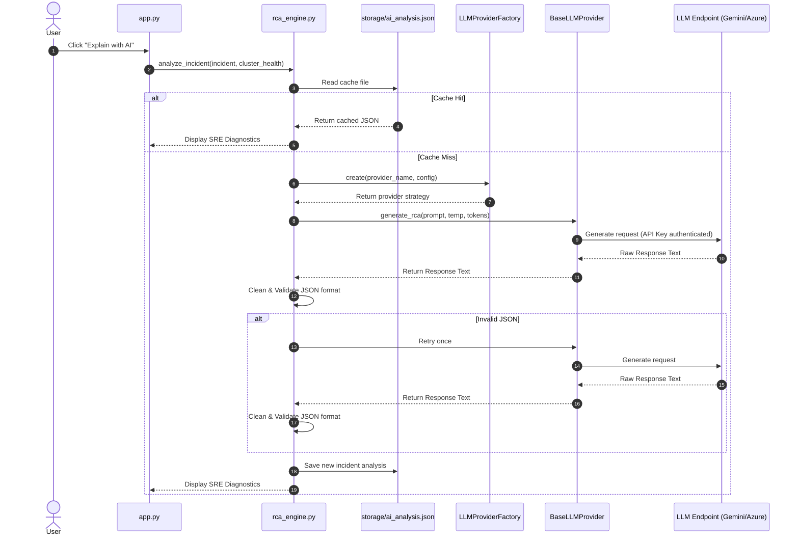

# AI Engine Design Document

## Table of Contents
1. [Overview](#1-overview)
2. [Why LLM is Used](#2-why-llm-is-used)
3. [Decoupled Telemetry Design](#3-decoupled-telemetry-design)
4. [Prompt and Context Engineering](#4-prompt-and-context-engineering)
5. [Hallucination Prevention & Validation](#5-hallucination-prevention--validation)
6. [Caching Strategy](#6-caching-strategy)
7. [Provider Factory & Strategy Patterns](#7-provider-factory--strategy-patterns)
8. [Data Flow Sequences](#8-data-flow-sequences)

---

## 1. Overview
The **AI Root Cause Analysis (RCA) Engine** implements a decoupled generative AI layer that consumes structured incidents, resolves SRE contexts, and produces deterministic diagnostic summaries. It utilizes abstract strategy wrappers to enable hot-swapping between LLM providers (e.g. Google Gemini and Azure OpenAI).

---

## 2. Why LLM is Used
While rule-based engines excel at flagging immediate issues (e.g., "Replica Down"), they cannot generalize across complex multi-step failures or suggest contextual resolutions. Large Language Models process the correlated incident timeline to construct an SRE narrative, identifying system regressions, assessing business impact, and recommending actionable remediation tasks.

---

## 3. Decoupled Telemetry Design
### 3.1 Why Raw Logs Are NOT Sent
- **Noise and Context Windows**: A 2-hour log stream for 5 nodes contains tens of thousands of lines. Ingesting raw logs introduces extreme noise, inflates LLM token consumption costs, and exceeds context limits.
- **Privacy and Data Exfiltration**: Production logs contain security keys, user queries, IPs, and schema details. Direct transmission risks compliance and data privacy breaches.

### 3.2 Why Correlated Incidents Are Sent
By applying SRE filters locally, we filter out 99% of normal operational background noise. The LLM receives a compressed JSON incident context (typically under 1KB) listing only relevant anomalies, timestamps, node scores, and the failure timeline.

---

## 4. Prompt and Context Engineering
The SRE prompt is loaded from [rca_prompt.txt](file:///Users/adityakumarbharatdeshmukh/Desktop/UserReady/solr-observability/prompts/rca_prompt.txt). It structures variables into a templated layout:
- **System Instructions**: Defines the persona (Apache Solr SRE expert) and enforces strict JSON output formats.
- **Incident Variables**: Dynamically binds `id`, `node`, `severity`, `category`, `cluster_health`, `duration`, `num_anomalies`, and the formatted `timeline`.

---

## 5. Hallucination Prevention & Validation
To ensure deterministic output, we implement the following guardrails:
- **Temperature = 0.0**: Force the model to select the most likely deterministic tokens.
- **Negative Constraints**: The prompt explicitly commands the model to base diagnostics *only* on the timeline, forbidding assumptions or external events.
- **Response Validation**: The [ResponseParser](file:///Users/adityakumarbharatdeshmukh/Desktop/UserReady/solr-observability/llm/response_parser.py) verifies key structure (summary, root_cause, business_impact, recommendations, priority, confidence).
- **Auto-Retry**: If parsing fails (e.g., due to extra markdown backticks), the engine retries once.
- **Confidence Score**: The model must assign an evidence-based confidence rating to its analysis.

---

## 6. Caching Strategy
To minimize duplicate API costs and ensure fast UI rendering, all completed analyses are cached in [ai_analysis.json](file:///Users/adityakumarbharatdeshmukh/Desktop/UserReady/solr-observability/storage/ai_analysis.json). When an incident is selected for analysis, the engine first checks the cache using the Incident ID.

---

## 7. Provider Factory & Strategy Patterns
The system uses the **Strategy Pattern** to represent LLM clients. The factory ([provider.py](file:///Users/adityakumarbharatdeshmukh/Desktop/UserReady/solr-observability/llm/provider.py)) exposes a common interface and instantiates the correct class based on `LLM_PROVIDER`.

Supported:
- **Azure OpenAI** ([openai_provider.py](file:///Users/adityakumarbharatdeshmukh/Desktop/UserReady/solr-observability/llm/openai_provider.py))
- **Google Gemini** ([gemini_provider.py](file:///Users/adityakumarbharatdeshmukh/Desktop/UserReady/solr-observability/llm/gemini_provider.py))

Extensible to (by adding another provider strategy):
- Anthropic Claude
- AWS Bedrock
- Vertex AI
- OpenAI API
- Ollama (Local)

---

## 8. Data Flow Sequences

### Mermaid Sequence: AI Analysis Execution

