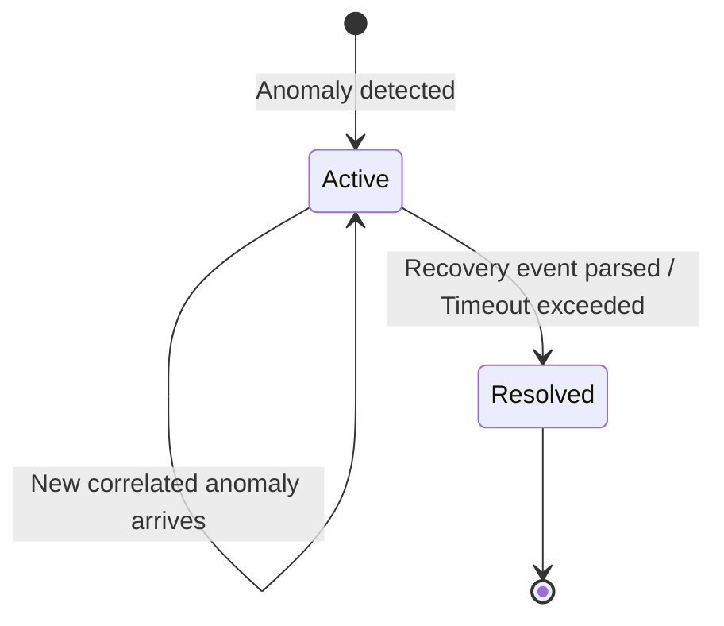

# Detection and Correlation Logic

## Table of Contents
1. [Overview](#1-overview)
2. [Log Parsing Mechanism](#2-log-parsing-mechanism)
3. [Rule-Based Anomaly Detection](#3-rule-based-anomaly-detection)
4. [Incident Correlation Engine](#4-incident-correlation-engine)
5. [Cluster Health Calculation](#5-cluster-health-calculation)
6. [Incident Lifecycle](#6-incident-lifecycle)
7. [Advantages of Rule-Based Detection](#7-advantages-of-rule-based-detection)
8. [Future Machine Learning Extensions](#8-future-machine-learning-extensions)

---

## 1. Overview
The **SRE Rules Engine** sits between log parsing and AI analysis. Its purpose is to process high-volume, real-time telemetry streams, isolate abnormal states, and group them into logical incidents that represent a unified outage event.

---

## 2. Log Parsing Mechanism
The parser executes incremental text scanning using file byte offset pointer persistence:
- **Solr Pattern**: Parses standard Solr timestamps, logs severity level (INFO, WARN, ERROR), node name, class component, and message payload.
- **JVM GC Pattern**: Parses G1GC format, capturing GC IDs, phases (Young, Mixed, Full, Concurrent Cycle), and heap transitions (`beforeM -> afterM(maxM)`).

---

## 3. Rule-Based Anomaly Detection
Anomalies are detected using strict string patterns and regular expression extractions:

### 3.1 Solr Anomaly Rules
| Event Trigger | Extracted Pattern | Severity | Category |
| :--- | :--- | :--- | :--- |
| **Replica Down** | `marked DOWN`, `replica reports down` | Critical | Connection |
| **Collection Degraded** | `Collection degraded`, `degraded status` | Critical | Connection |
| **Leader Election** | `initiating leader election`, `elected as new leader` | Warning | Connection |
| **ZooKeeper Disconnected** | `Lost ZooKeeper connection`, `ZooKeeper unreachable` | Critical | Connection |
| **Search Timeout** | `Search timeout`, `SocketTimeoutException` | Critical | Performance |
| **Query Latency > 3000ms** | `Query executed in > 3000 ms` | Critical | Performance |
| **Query Latency > 1000ms** | `Query executed in > 1000 ms` | Warning | Performance |
| **Index Commit Failure** | `Index commit failed`, `No space left on device` | Critical | Disk |
| **Recovery Failure** | `Recovery failed` | Critical | Connection |
| **Node Restart** | `Starting SolrCloud Node` | Warning | Connection |

### 3.2 JVM GC Anomaly Rules
| Event Trigger | Extracted Pattern | Severity | Category |
| :--- | :--- | :--- | :--- |
| **OutOfMemoryError** | `java.lang.OutOfMemoryError` | Critical | Memory |
| **Full GC** | `Pause Full` | Warning | Memory |
| **Full GC Pause > 5s** | `Pause Full ... > 5000.0ms` | Critical | Memory |
| **Repeated Full GC** | Multiple `Pause Full` within 5 minutes | Critical | Memory |
| **Heap Usage > 95%** | Heap utilization before GC > 95% of limit | Critical | Memory |
| **Heap Usage > 85%** | Heap utilization before GC > 85% of limit | Warning | Memory |
| **Promotion Failure** | `Promotion Failure`, `promotion failed` | Warning | Memory |
| **Allocation Failure** | `Allocation Failure` | Warning | Memory |

---

## 4. Incident Correlation Engine
The correlator groups anomalies into a single incident based on three criteria:
1. **Host Boundary**: The anomalies must occur on the same node.
2. **Context Similarity**: The anomalies must share the same category (e.g. Memory, Connection).
3. **Temporal Window**: The anomalies must occur within a sliding time window (defaults to **5 minutes**).

---

## 5. Cluster Health Calculation
Each node starts with a baseline score of **100**. Deductions are applied dynamically:
- **Active Critical Incident**: `-40` points
- **Active Warning Incident**: `-20` points
- **Recent Unresolved Anomalies**: `-5` to `-10` points

### Health Score Thresholds
- **Healthy**: Score $\ge$ 80
- **Warning**: 50 $\le$ Score $<$ 80
- **Critical**: Score $<$ 50

---

## 6. Incident Lifecycle
Incidents follow a structured transition sequence:

- **Active**: The incident is currently receiving new correlated anomalies.
- **Resolved**: Set when recovery messages (e.g., "Recovery completed successfully" or "stabilized") are parsed on that node.

---

## 7. Advantages of Rule-Based Detection
- **Zero Cold Start Delay**: Does not require training datasets or historical baselines.
- **Compute Efficiency**: Execution requires minimal CPU instructions compared to deep learning models.
- **Explainability**: Clear rule matching outputs (e.g., "Heap Usage >95%") make diagnostics transparent.

---

## 8. Future Machine Learning Extensions
- **Log Embeddings**: Using sentence transformers to vectorize log lines and identify anomalies using cosine similarity.
- **Dynamic Thresholding**: Applying Holt-Winters exponential smoothing to baseline normal query execution times and flag anomalies dynamically.
